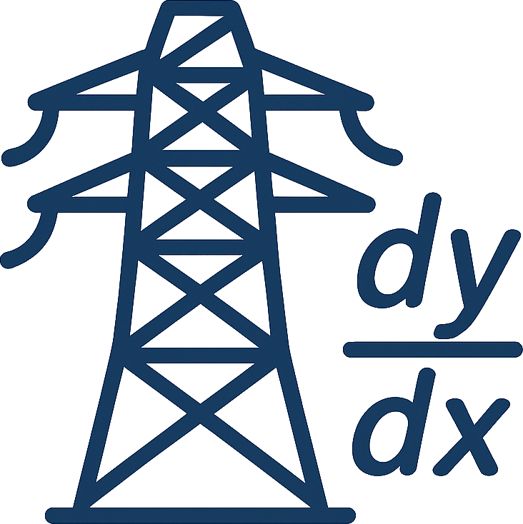

<div align="center">
  
</div>

-----------

[](https://www.python.org/downloads/)
[](https://opensource.org/license/mit)
[](mailto:markus.goetz@kit.edu)

Energy grids are vital but fragile infrastructures that require active management to maintain stability and avoid blackouts, a task complicated by increasing size and the transition to fluctuating renewable sources. We explore Differentiable Power Flow Optimization (DPF), a new method for power-flow simulation using gradient-based optimization, which, while slower than the standard Newton-Raphson (NR) for small grids, shows promise for parallelized time-series calculations and significantly outperforms NR in terms of time and memory scaling on very large grids.

## Installation
We heavily recommend installing the `differentiable-power-flow` package in a dedicated `Python3.11+` virtual environment. You can
install ``differentiable-power-flow`` directly from the GitHub repository via:
```bash
pip install git+https://github.com/Helmholtz-AI-Energy/differentiable-power-flow.git
```
Alternatively, you can install ``differentiable power flow`` locally. To achieve this, there are two steps you need to follow:
1. Clone the `differentiable power flow` repository:
   ```bash
   git clone git@github.com:Helmholtz-AI-Energy/differentiable-power-flow.git
   ```
2. Install the package from the main branch:
   - Install basic dependencies: ``pip install -e .``

## How to contribute
Check out our [contribution guidelines](CONTRIBUTING.md) if you are interested in contributing to the `differentiable-power-flow` project :fire:.
Please also carefully check our [code of conduct](CODE_OF_CONDUCT.md) :blue_heart:.

## Acknowledgments
This work is supported by the [Helmholtz AI](https://www.helmholtz.ai/) platform grant.

-----------
<div align="center">
  <a href="http://www.kit.edu/english/index.php"></a>
  <a href="https://www.helmholtz.ai/"></a>
</div>
